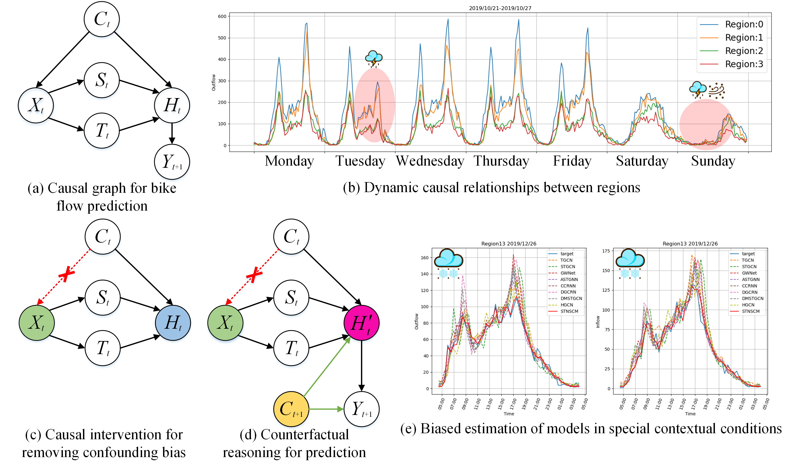
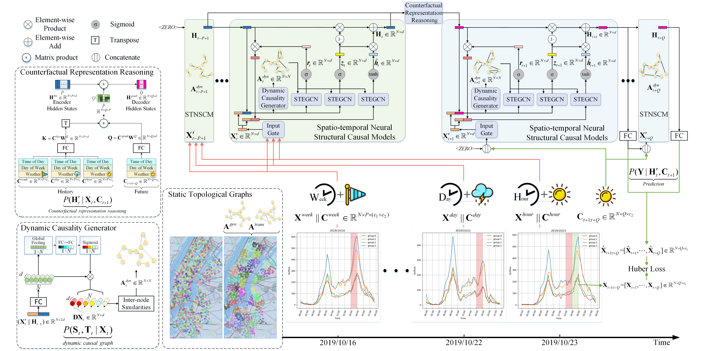

#  Spatio-temporal Neural Structure Causal Model (STNSCM)
This is the official release code of AAAI2023 accepted paper: "Spatial temporal Neural Structural Canal Models for Bike Flow Prediction"

The repository contains the necessary resources to run the experiments of the paper.

# Introduction
We propose a Spatio-Temporal Neural Structural Causal Model (STNSCM), and the causal graph shown in Fig. 1(c) and (d). 

Its core idea is based on structural causal model theory to remove confounders in the feature extraction process and follow the counterfactual reasoning framework to predict future bike flow. 

First, we apply the frontdoor criterion based on causal intervention, cutting off the link $\mathbf{C}_t \to \mathbf{X}_t$, which gives $\mathbf{X}_t$ a fair opportunity to incorporate each contextual condition $\mathbf{C}$ into spatio-temporal state $\mathbf{H}_t$. 

Second, we view future scenarios in a "what if" way, that is, if the current environment changes, how will the future state change, and thus how will future flow change? The key to answer this counterfactual question is how to make full use of future external conditions.



# How to run
It's very simple to run, just modify the `data_name` in `main.py`

Change `test_only=True` in `data/ ckpt /data_name/config.yaml`

`data_name = 'BJ'` Test the Beijing bike-sharing dataset

`data_name = 'NYC'` Test the NYC bike-sharing dataset

# Train

Change `test_only=False` in `data/ ckpt /data_name/config.yaml`

`data_name = 'BJ'` Train the Beijing bike-sharing dataset

`data_name = 'NYC'` Train the NYC bike-sharing dataset


# Model



Thank you for your attention to our work. 

If you find this repository, e.g., the code and the datasets, useful in your research, please cite the following paper:

```
@inproceedings{Zhao2023STNSCM,
    title={Spatial temporal Neural Structural Causal Models for Bike Flow Prediction},
    author={Zhao, Yu and Deng, Pan and Liu, Junting and Jia, Xiaofeng and Wang, Mulan},
    booktitle={Proceedings of the AAAI Conference on Artificial Intelligence},
    year={2023}
}
```
